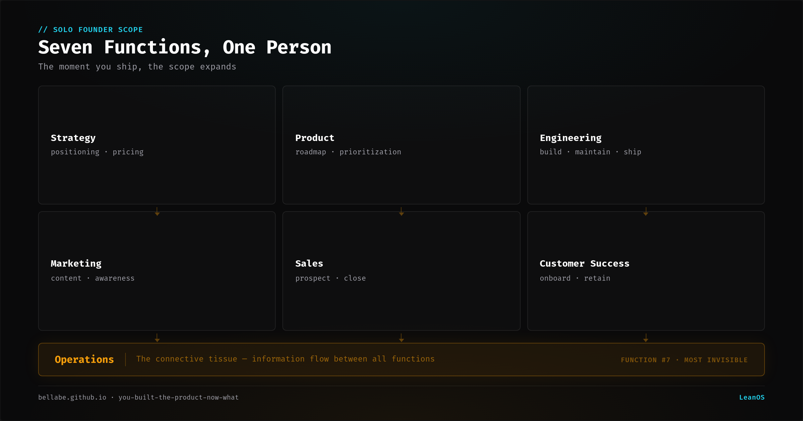
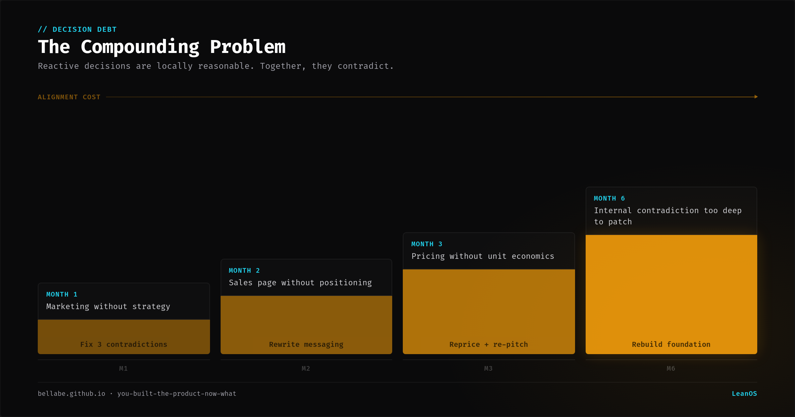
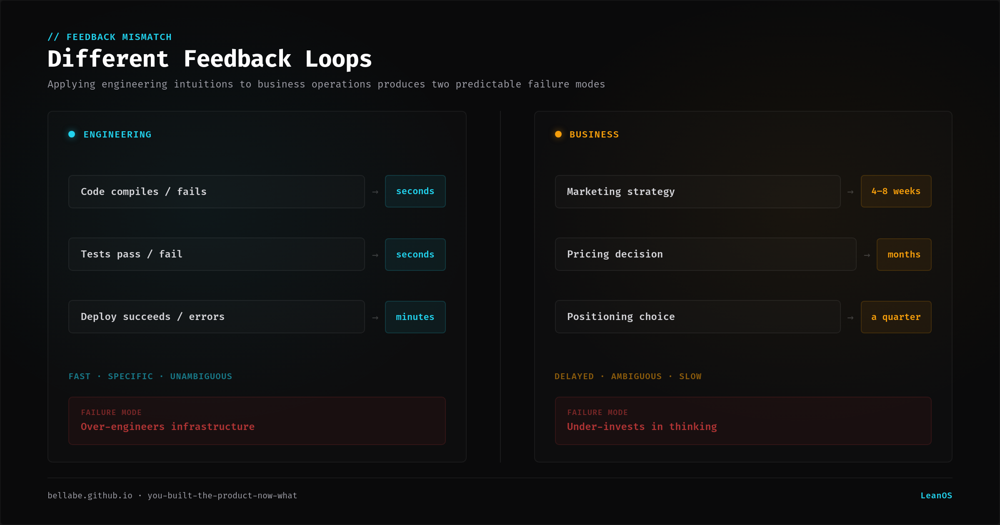
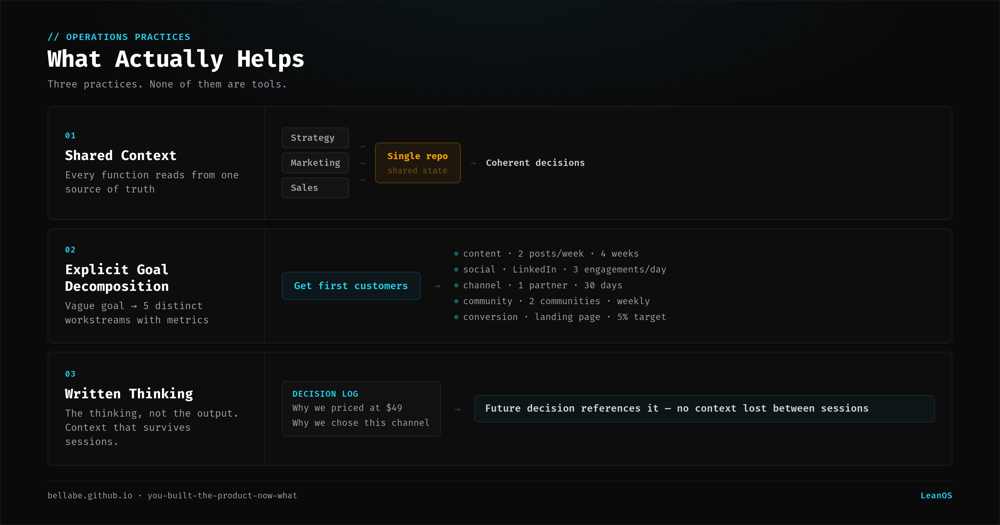

You shipped the product. Maybe an MVP. Maybe a working beta. Probably using AI for most of the code. The hard part is over, right?

No. The hard part just changed shape.

Technical founders are trained to build. Architecture, code, systems, deployment. The skills that got you to a working product are specific and deep. But the moment you ship, you enter a domain where those skills cover maybe 30% of what you need to do.

The other 70% is operations. And most technical founders are not prepared for how much of it there is.

---

## The seven functions nobody warned you about

After shipping, a solo founder runs at minimum seven business functions:

1. **Strategy.** Market positioning, competitive analysis, pricing, business model. Not a one-time exercise. Your strategy changes when you get real user data, and the decisions cascade into everything else.

2. **Product.** Requirements, prioritization, user feedback triage. Building features was the easy version. Deciding *which* features to build, and defending that decision against every piece of feedback, is harder.

3. **Engineering.** Still here. But now with maintenance, bug reports, infrastructure, and the growing debt from the code you wrote fast to ship.

4. **Marketing.** Content, distribution, SEO, social presence, community. Technical founders tend to either ignore this entirely or do it badly by applying engineering thinking to creative problems.

5. **Sales.** If you charge money, someone needs to close deals. At low ACV, that means building a self-serve funnel. At high ACV, that means conversations. Either way, it is a skill set most engineers have not practiced.

6. **Customer success.** Onboarding, support, retention, expansion. Users who pay expect a response. Users who do not pay still leave public reviews.

7. **Operations.** The connective tissue. How information flows between the six functions above. Who knows what. What gets updated when something changes. The function nobody names but everyone performs.

Most founders know this list exists. The gap is not awareness. The gap is *experiencing all seven simultaneously* while maintaining the execution quality that got you to a shipped product.

---

## The "figure it out later" compounding problem

The common approach: focus on engineering, handle everything else reactively.

Marketing happens when someone asks "how do people find this?" Sales happens when someone asks "how do I buy this?" Strategy happens during a crisis. Customer success happens when someone complains publicly.

This works for a week or two. Then it compounds.

A marketing decision made without strategy context targets the wrong audience. A sales page built without product positioning makes claims the product does not support. A pricing change without understanding unit economics creates a business model that cannot sustain itself.

Each reactive decision is locally reasonable. Together, they create a business that is internally contradictory. The marketing says one thing, the product does another, the pricing assumes a third.

The compounding effect: every month you operate reactively, the cost of aligning these functions increases. The longer you wait, the more decisions you need to unwind.

---

## Why engineers struggle with this specifically

Engineering has clear feedback loops. Code compiles or it does not. Tests pass or fail. Deployment succeeds or errors out. The feedback is fast, specific, and unambiguous.

Business operations have delayed, ambiguous feedback. A marketing strategy takes 4-8 weeks to show results. A pricing decision takes months to validate. A positioning choice might take a quarter to prove wrong.

Engineers in unfamiliar domains tend to do one of two things:

**Over-engineer the infrastructure.** Build elaborate Notion databases, Airtable automations, and Zapier workflows before doing the actual work. The tooling becomes the project. I have done this. I built a Notion system for customer tracking before I had a single customer.

**Under-invest in the thinking.** Skip strategy, skip research, skip positioning. Go straight to tactics. Write social posts without knowing who you are writing for. Build a landing page without testing the value proposition. Launch on Product Hunt before understanding your segment.

Both failure modes come from the same root: applying engineering intuitions to domains that do not work like engineering.

---

## What actually helps

Three things that changed how I operate across all seven functions. None of them are tools.

**Shared context across functions.** When your marketing knows your strategy, and your sales knows your product positioning, and your operations know your goals — decisions stop contradicting each other. The format does not matter. A spreadsheet, a doc, a repo. What matters is that every function reads from the same source of truth.

I use a repo with markdown files. Strategy, goals, marketing plans, sales pipeline — all in one place. Every decision references the same context. When strategy changes, the downstream functions see it immediately because they read the same files.

**Explicit goal decomposition.** A goal like "get first customers" is too vague to operate on. Decompose it: what content, on what channels, at what cadence, targeting what segment, converting through what mechanism, measured by what metric.

When I decomposed "launch and get first sales" into subgoals, I found five distinct workstreams: website content, social presence, a separate content channel, community distribution, and actual sales conversion. Each has different metrics, different activities, and different timelines. Treating them as one goal guaranteed that some would get no attention.

**Write the thinking down.** Not the output. The thinking. Why this channel and not that one. Why this price point. Why this positioning. The thinking is the context that makes future decisions coherent with past ones. It is also the thing most founders keep in their heads and lose when they context-switch.

I have 4 days of session logs. Each one captures what was built, what broke, what was learned. When I need to make a decision about marketing strategy, I do not rebuild context from memory. I read the log.

---

## The uncomfortable truth

The operations gap is not a problem you solve once. It is a permanent condition of running a business solo. Seven functions, one person, every day.

The founders who handle this well are not superhuman. They have systems that reduce the cost of operating across functions. Shared context so decisions are coherent. Decomposed goals so nothing gets ignored. Written thinking so context survives between sessions.

The founders who struggle are not incompetent. They are applying single-function depth (engineering) to a multi-function breadth problem (business operations). The skills that made them great builders are necessary but not sufficient.

If you just shipped and feel like the hard part is starting, not ending — you are reading the situation correctly.

---

*I am building a system to run all seven functions from one repo. It works for me. Whether it works for you depends on how you operate. More on that in future posts.*
