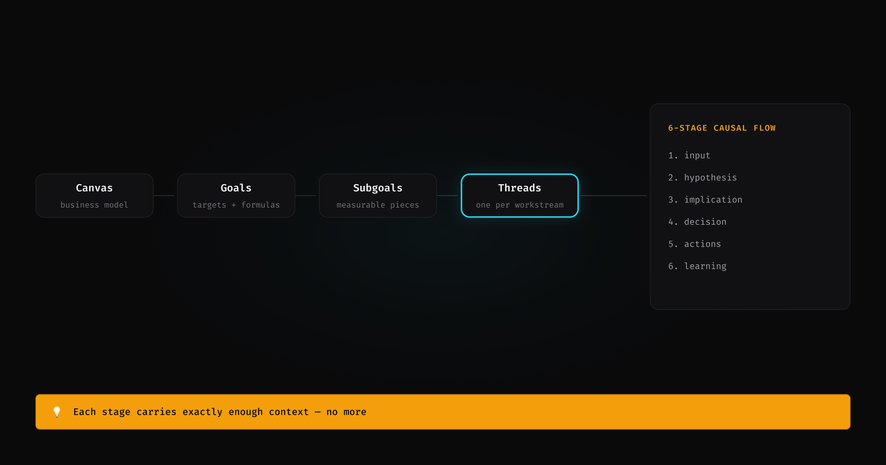

I run my business through AI agents. Not as a demo. Not as a proof of concept. As the actual operating system for strategy, marketing, sales, and engineering.

This is not a success story. This is a field report. Four days, multiple sessions, and a list of things that worked, things that broke, and what the process actually looks like.

---

## What "running a business through AI agents" actually means

It does not mean "I asked Claude for advice."

It means a systematic approach: every business function has agents that know the process, receive specific inputs, follow instructions, and produce specific outputs. The agents are connected — one agent's output becomes another's input. Operations stay coordinated because every agent reads from the same context.

Here is what that looks like concretely. Take marketing strategy. A marketing strategist agent needs to know the process of defining a marketing strategy. But knowing the process is not enough — it needs context. It reads: what are the active business goals? Who are the customers? What is the value proposition? Which channels do we distribute through? What is the go-to-market strategy? Who are the ideal customers? What brand voice should it use? How should it position?

It reads all of that from files in the same repo. Then it produces a strategy: which channels to prioritize, which content to create, through which funnel stages, and with what budget. That output becomes the input for the next agent — the content manager — who reads the strategy and produces the actual content.

Every function works this way. Sales reads goals and customer segments, produces outreach sequences. Product reads customer feedback and strategy, produces feature priorities. Engineering reads product specs, produces code. The coordination happens through shared files — not meetings, not Slack, not memory.

Here is what happened when I actually used it.

---

## Day 1: Canvas to execution in one session

I started with a completed business canvas — 16 sections covering business model, segments, positioning, channels, pricing, and go-to-market.

The process goes like this: canvas → goals → subgoals → execution threads.

First, a goal-definition agent reads the canvas and derives goals. Not vague goals — goals with targets, timelines, and formulas that trace back to canvas assumptions. "5 Pro sales by March 31" comes from the pricing section, the segment size, and the conversion assumptions. If the assumptions change, the goal changes.

Then a decomposition agent breaks each goal into subgoals. "5 sales" is too broad to act on. It becomes: build website authority, grow social presence, establish distribution, convert visitors to buyers. Each subgoal has its own target and a dependency chain — you cannot convert visitors you do not have.

Then an activation agent creates execution threads — one per workstream. Each thread follows a 6-stage causal flow: input → hypothesis → implication → decision → actions → learning. The art is keeping each stage lean and precise. The hypothesis stage gets only what it needs to reason about approach. The decision stage gets only the options and their trade-offs. No stage carries the full context — each carries exactly enough.

**What worked:** Goals traced back to canvas assumptions. Subgoals had measurable targets. Threads had clear owners. The causal flow forced structured thinking at each stage instead of jumping from goal to execution.

**What broke:** The system planned a product launch — but the product being launched was missing from its own scope definition. The canvas had pricing for Pro. The goals had sales targets. But the Pro repo was not listed in the MVP scope. A cross-reference check caught it. I fixed it in three files, but the gap had been there across multiple sessions.

**Lesson:** Cross-referencing catches what linear thinking misses. When strategy, goals, and execution live in the same repository, consistency checks run across all three layers. When they live in separate tools, nobody checks.

---

## Day 2: The same bug in every output

I needed visuals — LinkedIn banners, GitHub social preview, Gumroad covers, an X header. Eight assets total. I wrote a visual spec skill with precise rules: typography, spacing, layout, colors derived from design-system (generated by the system). Then I pointed it at 8 different assets.

Every single output had the same defect.

The spacing between elements was wrong. Not randomly wrong — systematically wrong. A heading set at 60px with 1.2 line-height takes up 72px of vertical space. But the AI placed the next element based on the starting position (60), not where the heading actually ended (132). Every spec, every time. The result: elements overlapping or cramped where they should have had breathing room.

The AI applied each rule correctly in isolation. It just did not track how the rules accumulated. It could not hold the running total — "this element ends here, so the next one starts there" — across a full layout.

This is important because it reveals how AI fails. Not randomly. Systematically. The same blind spot, reproduced identically across every output. If you check one and find a defect, check them all — you will find the same one.

**What worked:** Once I saw the pattern, fixing it was mechanical. I added a verification step: for every element, compute where it actually ends, then verify the gap before the next one starts. Applied the fix once, ran it across all 8 specs.

**What broke:** There was no mechanism to catch this automatically. The AI has no concept of "I made this mistake before." It will make it again tomorrow unless the verification step exists in the process.

**Lesson:** AI failures are systematic, not random. Do not fix outputs — fix the process. Add verification steps that check accumulated state, not just individual rules. One verification table catches the bug across every future output.

**A tip on generating visuals:** It turns out Claude is much better than Figma at producing visual artifacts through HTML. My current setup has a duplication — I write specs, then transfer them through Figma Make into designs. Not optimal. But I already have a solution waiting for implementation: Claude Code reads the spec, generates HTML, and Playwright screenshots the page into a PNG. It sounds a little cumbersome, but if it all runs through code, it means I can save hours on designing visual artifacts. I am not a designer at all — so having a pipeline that goes from spec to rendered image without leaving the terminal is a significant win.

---

## Day 3: The wrong building blocks produce the wrong output

I built a persuasion pattern library — 110 reusable atoms across 5 types (conversion, authority, narrative, educational, engagement) and 10 molecules (composed patterns).

Then the content manager agent used the library to draft social posts. Every post followed the same structure: hook, claim, CTA, "Core is free on GitHub."

The posts were pitchy. They sounded like ads. My strategy said "authority first" but the output was conversion-first.

The diagnosis: the content manager was pulling from the conversion pattern library. Conversion atoms produce conversion content. The prompt said "write authority content." The building blocks said "here are hooks, claims, and CTAs." The building blocks won.

**What worked:** The diagnosis itself. The problem was not the prompt or the model or the agent. The problem was the composable layer — which patterns were available determined what output was possible.

**What broke:** The assumption that prompt instructions override structural constraints. They do not. If the only atoms available are conversion atoms, the output will be conversion content regardless of the instructions.

**Lesson:** This is the same principle as a design system. You cannot build good UI from bad components. You cannot write authority content from conversion atoms. Fix the building blocks, not the prompt.

---

## Day 4: The coordination layer that solved the wrong problem

I had built a RevOps coordination layer. Four agents. Fourteen skills. Signal routing, scoring calibration, resource allocation, pattern detection.

None of them had ever run on real data.

RevOps exists in human organizations because humans work in silos. Marketing does not see what sales is doing. Sales does not see what customer success is tracking. RevOps patches that gap — it coordinates across teams that cannot coordinate themselves because they operate in separate tools with separate contexts.

I had imported that pattern into an AI system. But my AI system does not have silos. Every agent reads from the same repo. System state is shared. A reconciliation skill scans for entropy and heals inconsistencies. Hooks validate what each skill creates or updates. Artifact queries detect conflicts, duplication, and conflation automatically.

The coordination problem RevOps solves does not exist here. I had built a solution to a human-organization problem inside a system that is not a human organization.

I deleted all four agents and all fourteen skills. Then audited the remaining agents — found 7 with stale references to the layer I had just removed.

**What worked:** The deletion. But more importantly, understanding *why* it was wrong — not premature, wrong paradigm.

**What broke:** The assumption that market categories map to AI system architecture. RevOps is a patch for human coordination failure. AI systems with shared state do not need that patch.

**Lesson:** Before importing a coordination pattern, ask whether the coordination problem exists in your system. If all agents share state and you have reconciliation, hooks, and artifact queries — you already have coordination. Adding a layer on top adds hops without adding value.

---

## The pattern across four days

Day 1: Cross-referencing catches what linear thinking misses.
Day 2: AI output has systematic failure modes, not random ones.
Day 3: Building blocks determine output more than instructions do.
Day 4: Market categories do not map to AI system architecture.

The common thread: AI agents are not magic. They are systems with predictable failure modes. The value is not in the individual output — it is in the ability to operate across business functions with shared context and catch errors that would be invisible in fragmented tools.

Running a business through AI agents works. It means thinking systematically — defining precise inputs and outputs, letting AI do what it is capable of doing, and watching your business become more autonomous every day. The failures teach you where the boundaries are. The successes compound.

Four days, four patterns. The failures teach you where the boundaries are. The successes compound into workflows you could not have executed manually.

---

## How to do it

1. **Understand the process.** Read. Learn from experts. Study how the function actually works — marketing, sales, operations, whatever you are automating. You cannot skip domain knowledge.

2. **Evaluate how the human process transforms into an AI process.** Not every human workflow maps 1:1. Some steps disappear (coordination across silos). Some steps change (manual context-building becomes shared state). Some steps are new (reconciliation, hooks, artifact queries).

3. **Build and test.** The first outcome will be conflated — too many concerns in one skill, too many responsibilities in one skill, inputs and outputs tangled together.

4. **Add constraints and start over.** Separate concerns. Define precise inputs and outputs. Remove what does not belong. The second version will be cleaner. The third will be repeatable.

5. **Reach the clean process.** You will soon have a repeatable workflow that produces outputs you were not capable of producing in the pre-generative-AI era. Not because the AI is magic — because you defined the process clearly enough for it to execute.

The process keeps evolving, but the system is production-ready today.

**Want to see how it works?** [LeanOS Core is free](https://github.com/bellabe/leanos-core) — read the agent and skill files, try the reasoning system, decide if the architecture fits your workflow.

---

*This is a live system. I operate my business through these agents daily.*
