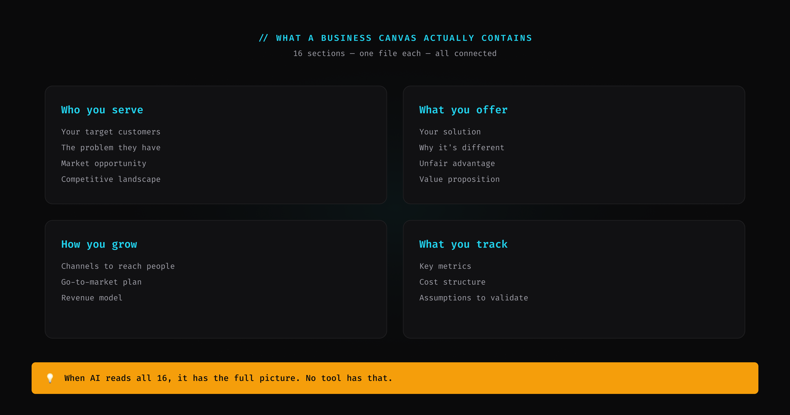
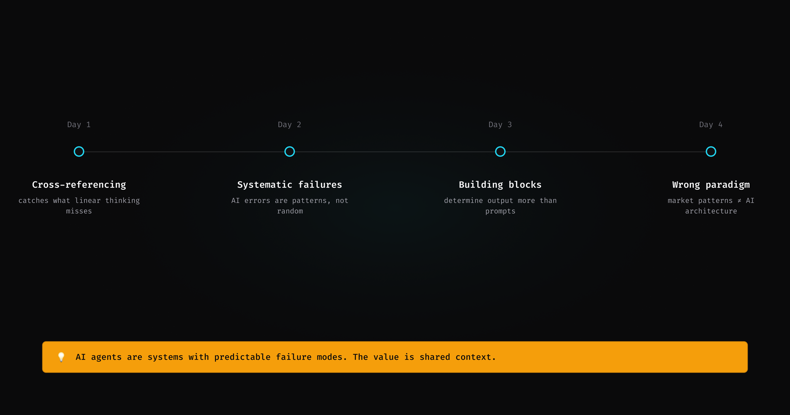
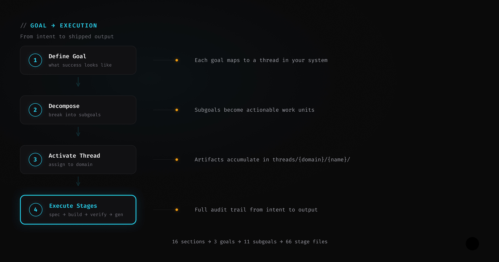

I run my business through AI agents. Not as a demo. Not as a proof of concept. As the actual operating system for strategy, marketing, sales, and engineering.

This is not a success story. This is a field report. Four days, multiple sessions, and a list of things that worked, things that broke, and what the process actually looks like.

---

## What "running a business through AI agents" actually means

It does not mean "I asked Claude for advice."

It means structured agents — each with defined inputs, outputs, skills, and responsibilities — that execute business functions. A marketing strategist agent that reads goals and produces channel strategies. A content manager agent that reads strategies and produces content. A goal tracker that reads execution logs and reports progress against targets.

Each agent reads files, reasons about what to do, produces files, and hands off to the next agent. The coordination medium is the file system. Shared state is markdown files in a repo.

As of today, the system has 40+ agents and 180+ skills across 8 business domains: strategy, product, engineering, marketing, sales, customer success, orchestration, and operations.

Here is what happened when I actually used it.

---

## Day 1: Canvas to execution in one session

I started with a completed business canvas — 16 sections covering business model, segments, positioning, channels, pricing, and go-to-market. I pointed the goal-definition agent at it.

The system derived 3 parent goals from the canvas data. Then the goal-decomposition skill broke them into 11 subgoals using derivation formulas — each with target values, measurement methods, and dependency chains. Then the goal-activation skill created 11 execution threads across 4 domains, each with the 6-stage structure the system uses for every piece of work.

Canvas to ready-to-execute in one session. 16 strategy sections, 3 parent goals, 11 subgoals, 11 threads with 66 stage files.

**What worked:** The derivation chain was sound. Goals traced back to canvas assumptions. Subgoals had measurable targets. Threads had clear owners.

**What broke:** The system launched itself. But the product it was launching — the actual Pro repo — was missing from the launch checklist. The canvas audit agent caught it. The product was referenced in pricing but absent from the MVP scope definition. I fixed it in three files. But the gap existed across multiple sessions before an automated cross-reference check found it.

**Lesson:** Cross-referencing catches what linear thinking misses. When strategy, goals, and execution live in the same repository, consistency checks can run across all three layers. When they live in separate tools, nobody checks.

---

## Day 2: The universal bug in generated output

I had the system generate visual specifications for 8 channel assets — LinkedIn banners, GitHub social preview, Gumroad covers, X header.

Every single spec contained the same defect.

Text elements were positioned by y-coordinate without accounting for rendered height. A 60px heading at 1.2 line-height occupies 72px of vertical space. But the next element was placed relative to the y-coordinate (60), not the rendered bottom (60 + 72 = 132). Worst case: a 2px gap where 24px was needed.

This is what AI-generated output looks like when you do not have verification. The model applies the positioning rule correctly in isolation. It does not track the accumulated state (rendered heights) that determines whether the rule produces correct output in context.

**What worked:** Once I identified the pattern, fixing it was systematic. Add rendered height per element, compute rendered bottom, verify spacing ratios. Apply to all 8 specs.

**What broke:** The same bug in every spec. The model has no concept of "I made this mistake before, check for it."

**Lesson:** AI output has systematic failure modes, not random ones. When a model gets something wrong, it gets the same thing wrong everywhere. The fix is verification tables, not better prompts. Check the accumulated state, not just the individual step.

---

## Day 3: The wrong building blocks produce the wrong output

I built a persuasion pattern library — 110 reusable atoms across 5 types (conversion, authority, narrative, educational, engagement) and 10 molecules (composed patterns).

Then the content manager agent used the library to draft social posts. Every post followed the same structure: hook, claim, CTA, "Core is free on GitHub."

The posts were pitchy. They sounded like ads. My strategy said "authority first" but the output was conversion-first.

The diagnosis: the content manager was pulling from the conversion pattern library. Conversion atoms produce conversion content. The prompt said "write authority content." The building blocks said "here are hooks, claims, and CTAs." The building blocks won.

**What worked:** The diagnosis itself. The problem was not the prompt or the model or the agent. The problem was the composable layer — which patterns were available determined what output was possible.

**What broke:** The assumption that prompt instructions override structural constraints. They do not. If the only atoms available are conversion atoms, the output will be conversion content regardless of the instructions.

**Lesson:** This is the same principle as a design system. You cannot build good UI from bad components. You cannot write authority content from conversion atoms. Fix the building blocks, not the prompt.

---

## Day 4: The coordination layer that solved the wrong problem

I had built a RevOps coordination layer. Four agents. Fourteen skills. Signal routing, scoring calibration, resource allocation, pattern detection.

None of them had ever run on real data.

RevOps exists in human organizations because humans work in silos. Marketing does not see what sales is doing. Sales does not see what customer success is tracking. RevOps patches that gap — it coordinates across teams that cannot coordinate themselves because they operate in separate tools with separate contexts.

I had imported that pattern into an AI system. But my AI system does not have silos. Every agent reads from the same repo. System state is shared. A reconciliation skill scans for entropy and heals inconsistencies. Hooks validate what each skill creates or updates. Artifact queries detect conflicts, duplication, and conflation automatically.

The coordination problem RevOps solves does not exist here. I had built a solution to a human-organization problem inside a system that is not a human organization.

I deleted all four agents and all fourteen skills. Then audited the remaining agents — found 7 with stale references to the layer I had just removed.

**What worked:** The deletion. But more importantly, understanding *why* it was wrong — not premature, wrong paradigm.

**What broke:** The assumption that market categories map to AI system architecture. RevOps is a patch for human coordination failure. AI systems with shared state do not need that patch.

**Lesson:** Before importing a coordination pattern, ask whether the coordination problem exists in your system. If all agents share state and you have reconciliation, hooks, and artifact queries — you already have coordination. Adding a layer on top adds hops without adding value.

---

## The pattern across four days

Day 1: Cross-referencing catches what linear thinking misses.
Day 2: AI output has systematic failure modes, not random ones.
Day 3: Building blocks determine output more than instructions do.
Day 4: Market categories do not map to AI system architecture.

The common thread: AI agents are not magic. They are systems with predictable failure modes. The value is not in the individual output — it is in the ability to operate across business functions with shared context and catch errors that would be invisible in fragmented tools.

Running a business through AI agents works. It means thinking systematically — defining precise inputs and outputs, letting AI do what it is capable of doing, and watching your business become more autonomous every day. The failures teach you where the boundaries are. The successes compound.

---

## How to do it

1. **Understand the process.** Read. Learn from experts. Study how the function actually works — marketing, sales, operations, whatever you are automating. You cannot skip domain knowledge.

2. **Evaluate how the human process transforms into an AI process.** Not every human workflow maps 1:1. Some steps disappear (coordination across silos). Some steps change (manual context-building becomes shared state). Some steps are new (reconciliation, hooks, artifact queries).

3. **Build and test.** The first outcome will be conflated — too many concerns in one skill, too many responsibilities in one skill, inputs and outputs tangled together.

4. **Add constraints and start over.** Separate concerns. Define precise inputs and outputs. Remove what does not belong. The second version will be cleaner. The third will be repeatable.

5. **Reach the clean process.** You will soon have a repeatable workflow that produces outputs you were not capable of producing in the pre-generative-AI era. Not because the AI is magic — because you defined the process clearly enough for it to execute.

---

*This is a live system. I will keep publishing what works, what breaks, and what I learn. The process is more interesting than the output.*

